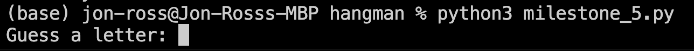

# Jon-Ross Stanley-Owusu

# Project Title: Hangman

## Table of Content

1. [Project Description](#project-description)
2. [Installation Instructions](#installation-instructions)
3. [Usage Instructions](#usage-instructions)
4. [Game Walkthrough](#game-walkthrough)
5. [Class Breakdown](#class-breakdown)
6. [File Structure of the Project](#file-structure-of-the-project)
7. [License Information](#license-information)

## Project Description

### What It Does

This Hangman project is a Python-based implementation of the classic Hangman game. The objective is simple: the computer randomly selects a word, and the player tries to guess it, one letter at a time. The player has a limited number of guesses, and for each incorrect guess, a part of the 'hangman' is drawn.

### The Aim of the Project

The main goal of this project is to provide an interactive way for a user to play Hangman. This project has peaked my insight into understanding Python programming, especially focusing on Object-Oriented Programming.

### Learning Outcomes

Through this project, I have gained a deeper understanding of:
- Python programming basics and advanced concepts.
- Object-Oriented Programming (OOP) in Python, including classes, objects, methods, and attributes.
- Working with external modules and files in Python eg. import milestone_2, which contains the word list
- Handling user inputs and validating them.

## Installation Instructions

To get started with the Hangman game, the latest version of Python should be installed on a computer with a CLI (Mac, Windows or Linux).

## Usage Instructions

To play the game, navigate to the project directory in your terminal or command prompt and run the following command:

python3 milestone_5.py

This will start the game, and you'll be prompted to guess letters.

## Game Walkthrough

#### **Game Start:** Initial prompt to enter a letter.

#### **Correct Guess:** Guessing a letter correctly.

#### **Incorrect Guess:** Guessing a letter incorrectly.

#### **Lives Reduction:** Reduction of lives after guessing an incorrect letter.

#### **Letter Repetition Prompt:** Prompt upon repeating a letter.

#### **Winning:** Guessing the word correctly and winning the game.

## Class Breakdown

### Attributes:

word_list: List of possible words for the game.

num_lives: The number of incorrect guesses allowed before the game ends.

word: The word selected for the current game.

word_guessed: A list representing the word in its guessed state, with underscores for unguessed letters.

num_letters: The count of unique letters in the word that haven't been guessed yet.

list_of_guesses: A record of all the guesses made so far.

### Methods:

__init__(self, word_list, num_lives = 5): Constructor to initialise the new game.

check_guess(self, guess): Checks whether the guessed letter is in the word.

ask_for_input(self): Prompts the player to guess a letter and handles the input.

Gameplay Overview

Start: The game begins by selecting a random word from a predefined list.

Player Input: The player is prompted to guess one letter at a time.

Guess Evaluation: Each guess is evaluated to determine if it's part of the word.

Game Progress: The game keeps track of correctly guessed letters, remaining lives, and previously guessed letters.

Win/Lose Conditions: The game ends when the player either guesses the word correctly or runs out of lives.

Through each step, the player receives feedback about their guesses, the current state of the word, and their number of remaining lives.

## File Structure

├── milestone_2.py          # milestone_2.py contains the fruit word list.

├── milestone_3.py          # milestone_3.py contains the check_guess & ask_for_input functions.

├── milestone_4.py          # milestone_4.py creates the Hangman class with 2 attributes and 2 methods.

├── milestone_5.py          # launches the entire game using the play_game function.

├── hangman_Template.py     # helped as a guide in developing the project. Also gave useful hints

└── README.md               # Overall information about this Hangman project

## License Information

MIT License

Copyright (c) [2023] [Jon-Ross]